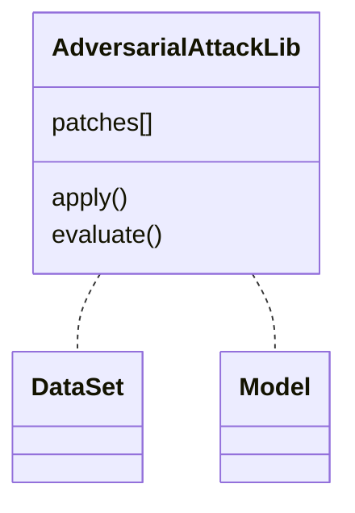

# Design Process Recommendations

Design is one component of the product development lifecycle and arguably the most important. Good design balances the needs of the user against the resources available for development and maintenance of the product. This document endeavors to list those practices that lead to good design.

> Callouts, formatted like this one, below point out the salient details and recommendations, and in some cases, firm requirements when preceded by "**Requirement**".

## Agile vs. Waterfall

In a typical waterfall development, all planning and design happens before any building begins and typically not by those doing the work. This can be a viable strategy when essentially all requirements and expectations are known a priori but this is seldom the case. Feedback from stakeholders, unforeseen use cases, and technical advances, among other things, can all lead to new requirements and expectations.

Agile development embraces change -- pivoting without mercy or guilt when new information becomes available. To adapt and respond to this change, the Agile development process is an iterative one. Each iteration cycle typically involves some degree of planning, design, development, testing, and review, potentially followed by deployment. Developers are directly involved in the planning and design which is done closer to the work. Feedback from one cycle affects the next, influencing the direction and priorities of the development.

> **Requirement**: For all the reasons mentioned, vendors working on the JATIC program will follow Agile development practices.

## Design Documentation

Given that vendors will be using Agile methods to develop their products, the need for full product specifications to be drawn up prior to implementation becomes unnecessary. However, some amount of up-front design must be considered, documented, and reviewed to ensure value to the sponsor, ease of integration, and system cohesiveness. This section describes the minimum set of recommended design documentation.

Also note, that while these documents should be pretty fleshed out at the start of development, they are living documents and should be updated accordingly during each Agile iteration.

> **Requirement**: To prevent "doc rot", design documentation will be kept close to the source code in the product repository and will be written in Markdown.

**NOTE**: I'm avoiding the more common terms "Functional Specification", "High-Level Design Specification", etc., the word "specification" in general, and the connotations that go along with it.

### Functional Description

The functional description is not a design document per se, but provides a foundation and source of truth about the product from which all design flows.

> The functional description describes the what, why and how of the product from the user's perspective, providing a concise readout of what it offers. 

The functional description may be considered a subset of a "concept of operations" document. However, the operation and maintenance aspects which will be common to all vendors are not specified in the functional description.

The functional description should answer at least the following questions:

1. What is the product being built? The answer should include a general product description. For example, "the product is a software tool for evaluating the efficacy of an adversarial pattern placed atop each image of a dataset."
2. What are the goals and objectives of the product? In other words, what is the purpose of the product? For example, "the product allows the user to study the affects of adversarial patterns on machine learning models trained for object detection."
3. What is the value for the user? The answer may address these additional questions: why would the user choose this product over another? and what can this product do that other cannot?
4. What are the deliverables? "Deliverables include a Python software library which provides adversarial pattern placement and evaluation capabilities, and sample Jupyter Notebooks that demonstrate its use."
5. How will the user interact with the product? The answer should be at a high level and not cover details of programming interfaces, such as "the user will typically modify the contents of a provided sample Jupyter Notebook to utilize their own datasets and models. Alternatively, the user may incorporate the library into their own code and directly use its public API to apply adversarial patterns and evaluate performance of object detection models."
6. What are the high-level requirements of the product? The requirements should be from the user's perspective. In the Agile view, these may serve as Epics or Feature Stories. "The product must provide access to both standard models and datasets available remotely as well as local, user-provided ones." "The product must let the user collect and compare results across a range of models and datasets."
7. Are there any known, specific up-front requirements? These may be detailed requirements that are well-defined when the project starts, such as specific required features or performance metrics that must be met. Many times, these types of requirements can be associated with Agile stories as acceptance criteria.

### High-Level Design

Once a well thought out and documented functional description is available, the most important design document to be created is the high-level design.

> The high-level design describes the software architecture of the product.

Typically the software architecture can be represented as a single diagram (with enough descriptive text) that provides a reference for anyone building the product or trying to understand how it works. Supporting diagrams such as information flows may also be appropriate, if not obvious from the architecture.

> **Requirement**: To facilitate change tracking, pictorial representations of the software architecture will be represented by a diagram that can be textually described and included in the high-level design document.

Several text-based diagramming tools are available with integrated rendering in VSCode and GitLab. Popular alternatives include [Mermaid](https://mermaid.js.org/) and [PlantUML](https://plantuml.com/). **NOTE**: Mermaid appears to be enabled in GitLab by default and may be a good choice. PlantUML is more feature-rich, but requires a separate server (or use of a public server). Here is a simple example of how a diagram would render in GitLab using Mermaid:

Besides the software architecture diagram, the high-level design should include:

1. A brief description of the expected software components that comprise the product. This includes both vendor developed and third-party dependencies. For example, if the product is a Python package, the component would be a list of modules to be developed and dependent packages (NumPy, PyTorch, etc.).
2. The platforms or target environment where the product will run.
3. Identification of risks. This may include risks in choice of technology or due to assumptions made in the design.
4. **Anything else?**

### Interface Design

Before implementation, thought needs to be given to the interfaces of the product.

> The interface design document describes the capabilities of the user interface and any other available interfaces such as API, data providers, REST endpoints and the like.

The interface design document is not a replacement for API documentation that can easily be generated with documentation tools, nor is it a screen capture of command line option descriptions (though those things, or links to them, can be included if available). Rather, it should make clear to users how they will work with the product as well as instruct system integrators and testers how the product will interface with other products. Additionally, the document may spell out what is expected from other products that have not yet been defined.

### Detailed Design

A detailed design delves into the particulars of the software components and how they interact. As development proceeds and things change, this type of documentation typically is incomplete at best, and misinformative at worst. The source code is truth and well written source code should be well documented if not self-documenting. See the [coding guidelines](guidelines/Python%20Coding%20Guidelines.md) for code documentation practices. For these reasons:

> No detailed design documentation is required or necessary.

That said, it is often useful to capture some design information within Agile stories and tasks where appropriate. It helps communicate intent to the developers working on the story. However, the amount of design information and what specifically to include, if any at all, is highly dependent on the story and the capabilities of the individuals performing the work. In essence, stories are a placeholder for a conversation.

## Definition of Done

The definition of done for some effort, whether a single issue, a research spike, an epic or even a project is a checklist of items that need to be accomplished before the effort can me truly called done. This section details suggested checklist items for certain efforts.

### User Stories and Technical Issues

For a user story or feature, or for a technical issue that is not user-facing, the definition of done may include the following items (note that this may be tailored on a per-story basis):

* [ ] Source code compiles without warnings or errors
* [ ] Code linted and formatted
* [ ] Code committed to version control system
* [ ] New and existing unit tests pass
* [ ] Code coverage of unit tests is the same or better
* [ ] Code review complete, merge request approved, and code merged to main/dev branch per the [branch, merge, and release strategy](./Branch%2C%20Merge%2C%20Release%20Strategy.md).
* [ ] CI/CD pipeline stages assessing code quality, security, and accessibility pass
* [ ] Functionality demonstrated and accepted by Product Owner
* [ ] Design documentation updated (particularly architecture and interface design)
* [ ] Interface documentation generated and published
* [ ] New third-party dependencies have been vetted (both for security and legal)
* [ ] New issues created to capture defects or functionality yet to be implemented

### Spikes

Spikes are time-bound investigations of particular focus. They may include research to learn about a new technology, prototyping to prove out a proposed solution, or conversations with other vendors or service providers. For a spike, a definition of done is much more limited:

* [ ] Findings and any decisions are documented using markdown in an appropriate Gitlab repo and disseminated
* [ ] Follow-up stories are added to the backlog

Occasionally a spike may not have and reasonable output once the time limit is reached. In this case, the story can be re-pointed, duplicated, or abandoned as necessary.

### Epics

An epic is a large feature, a set of features or a capability usually comprising a number of user stories. The definition of done for an epic is simply that all its constituent stories are done.

Often integration tests or system tests should accompany an epic. Because these tests include more effort than a typical unit test, it's recommended to make them technical issues as part of the epic.

More information about epics can before in the Agile processes document [here](https://gitlab.jatic.net/jatic/docs/org-process/-/blob/main/Gitlab%20for%20Agile.md#epics).
